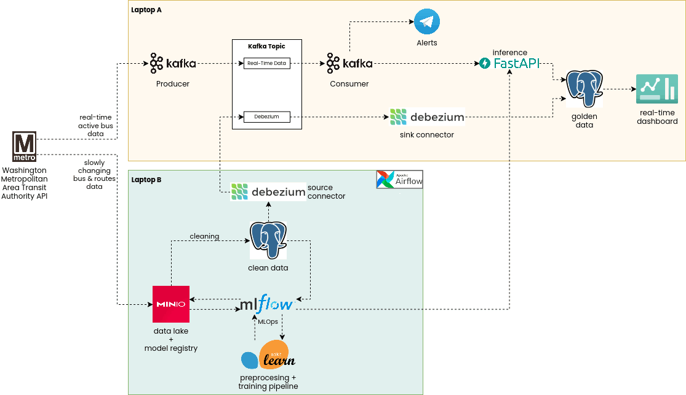

# IPBD Kelompok 8 - TBP
<p align="center">
  Prayuda Afifan Handoyo | L0224008 | Kelas A<br>
  Meiva Yusnita Amalia W.K. | L0224044 | Kelas A<br> 
  Infrastruktur dan Platform Big Data
</p>

# Real-Time Bus Monitor

Pipeline untuk Monitoring Posisi Bus dan Prediksi Keterlambatan Real-Time di Washington D.C.

## Arsitektur



Pipeline dikembangkan dalam 3 fase. Diagram di atas adalah arsitektur target akhir.

## Setup Awal

### 1. Clone repository (di kedua laptop)

```bash
git clone git@github.com:prayudahlah/real-time-bus-monitor.git
cd real-time-bus-monitor
```

### 2. Setup environment variables

**Laptop Batch:**

```bash
cp batch/.env.example batch/.env
# Isi variabel-variabelnya
```

**Laptop Stream:**

```bash
cp stream/.env.example stream/.env
# Isi variabel-variabelnya
```

### 3. Start services

Kedua laptop bisa di-start **independen** — tidak ada dependensi satu sama lain di fase ini.

**Laptop Batch:**

```bash
cd batch
docker compose up -d
```

**Laptop Stream:**

```bash
cd stream
docker compose up -d
```

### 4. Verifikasi

| Service | URL | Laptop |
|---|---|---|
| MinIO Console | `http://{BATCH_IP}:9001` | Batch |
| MLflow UI | `http://{BATCH_IP}:5000` | Batch |
| Airflow Webserver | `http://{BATCH_IP}:8080` | Batch |
| FastAPI Inference | `http://{STREAM_IP}:8000/health` | Stream |

### Konfigurasi koneksi:

| Arah | Tujuan | Port | Fase |
|---|---|---|---|
| Stream → Batch | MLflow Tracking API | 5000 | Phase 2 |
| Batch → Stream | Kafka bootstrap server | 9092 | Phase 3 |
